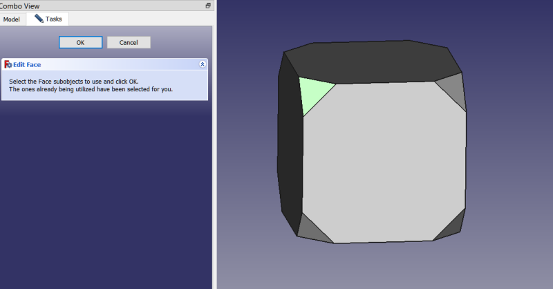

# parametric_defeaturing
FreeCAD macro providing parametric defeaturing inside and outside of Part Design.  Select one or more faces of an object and run the macro.  It will attempt to defeature the object, removing those faces.  Similar in functionality to the Defeaturing tool in Part workbench except this one is parametric and works inside Part Design bodies as well as outside of Part Design.

## Installation
Not available yet in the Addon Manager.  Copy the parametric_defeaturing.FCMacro file to your macro folder.  On first run it will ask to create an additional file, parametric_defeaturing.py, from which it imports the class definitions needed to make the objects created with the macro parametric after restarting FreeCAD and loading a file with one of the objects in it.

## Toolbar Icon
 <a href="parametric_defeaturing.svg">Download</a> the toolbar icon.

## Properties
### Faces (LinkSub)
This has 2 values stored as a python tuple: 1) the object being the defeatured; and 2) a list of Face names to use for defeaturing.  Defeaturing is based on faces only, not edges or vertices.

### Version (string)
Version of the parametric_defeaturing macro used to create this ParametricDefeaturing object.

### Refine (boolean)
Default: False, unless inherited from PartDesign::FeatureAdditivePython, this object's base class when created to defeature a Part Design feature, in which case it depends on user's settings.  Removes superflous edges from coplanar faces.

### ClaimChildren (boolean)
Default: False if in Part Design body, True otherwise.  If True, the defeatured object gets nested in the tree beneath the ParametricDefeaturing object.  This only affects the way it looks in the tree view.

### DefeaturingSuccess (boolean)
If True, defeaturing succeeded.  If False, defeaturing failed.

### EditFaces (boolean trigger)
Default: False.  If toggled to True it returns itself to False and opens a Task Dialog to edit the Faces used in the defeaturing operation.  The dialog is very simple, with only 2 buttons: OK and Cancel.   The faces currently being used for defeaturing are automatically selected for you in the 3d view.  Edit this selection in the 3d view and click OK to dismiss the dialog and apply the changes.

### Changelog
* 0.2010.10.05 initial upload
